A little while ago, I decided to build my own self driving car. Before going for the regular human sized car, I wanted to make sure I was able to achieve it on a small scale version, hence the RC Car choice. I going to share with you how I managed to do that.

## Hardware Assembly

### Chassis

I first started with very basic chassis and motors ...

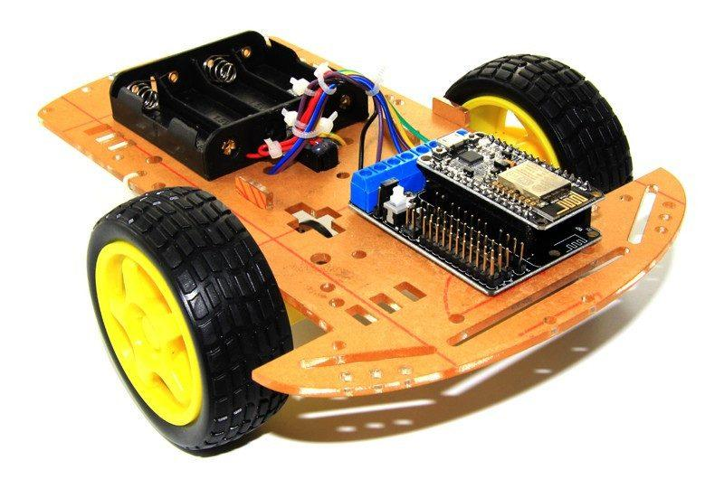

I really quickly realised it would be impossible to do any kind of accurate control, the battery would die really fast and the car would be unbearably slow.

I decided to invest into some robust and reliable pieces of hardware. I was inspired by the RC car community. I chose the Sakura Ultimate (at least that is how it was labelled on AliExpress) for the chassis.

### Battery

I chose a LiPo battery for its good energy density and voltage dropoff curve. One disadvantage with LiPo batteries is that if their voltage drop bellow a certain level it is not possible to charge them again afterwards. As a result I bought this cheap voltage checker which beeps very loudly when it's time for a charge.

### Motor and ESC

I chose a motor used for RC car racing because I wanted to be able to play with the speed my self-driving car and see how fast I could make it go.

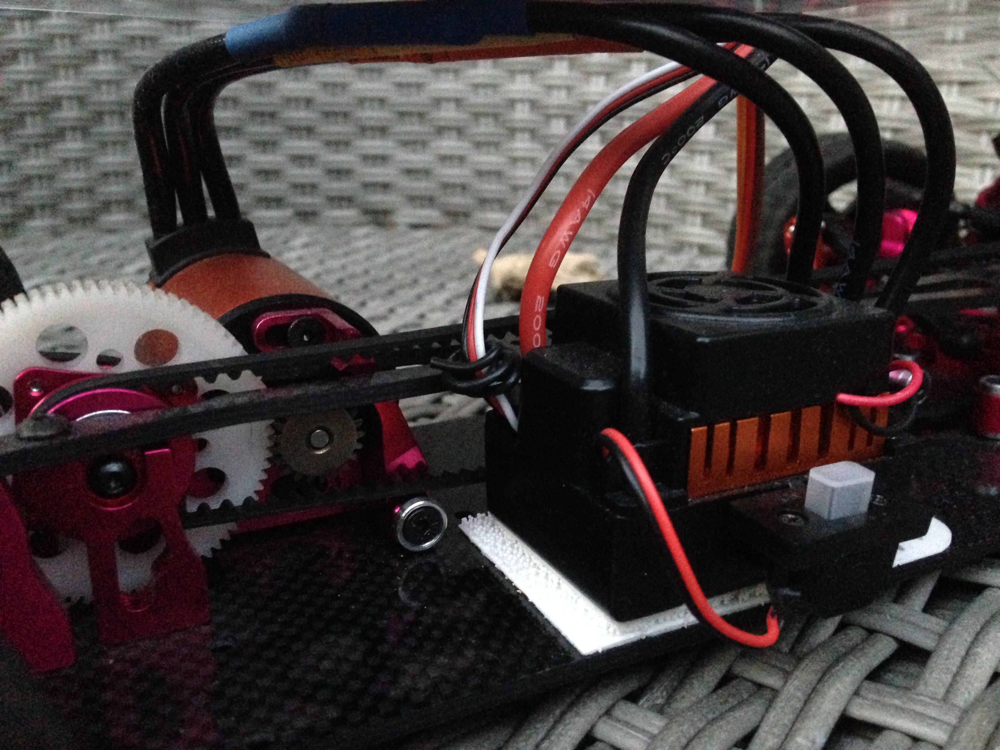

### Steering Servo

I chose to use the relatively powerful servo motor MG996R.

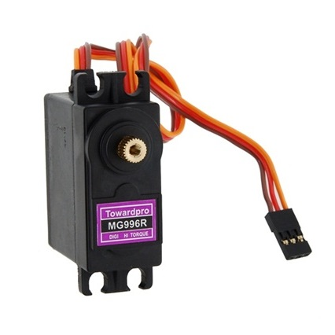

Once fixed onto the car and hooked up to the servo horn.

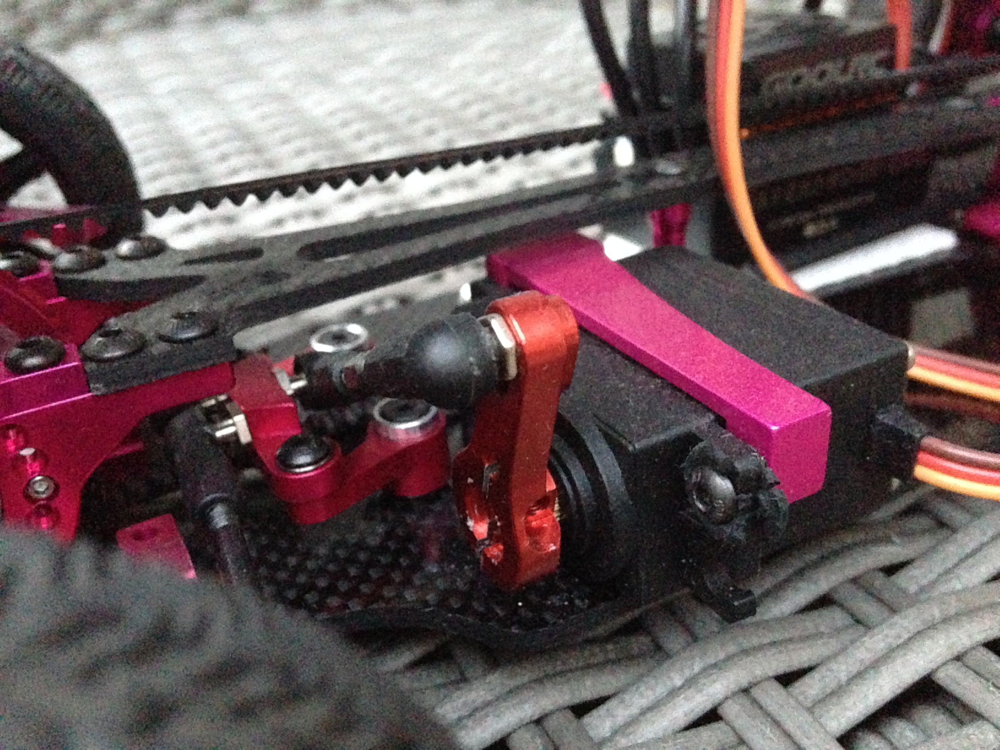

### Steering and Throttle Control

The steering servo and the ESC (throttle motor) are controlled by PWM [Pulse Width Modulation](https://www.arduino.cc/en/Tutorial/SecretsOfArduinoPWM). By using PWM, a digital signal (either ON or OFF) can control a device requiring an analog signal (continuous signal which can take any values between 0 and the maximum voltage) by modulating the average time the signal is ON relative to the time it is OFF.

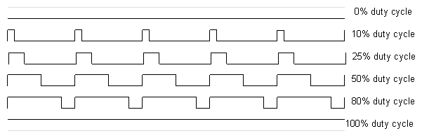
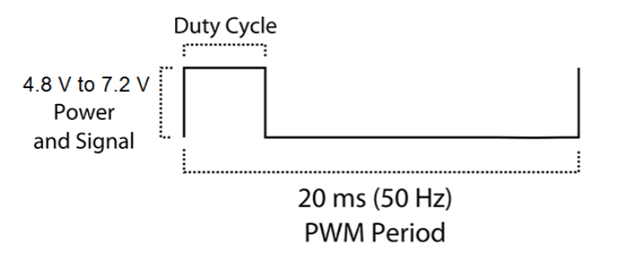

In practice, each time the signal needs to be flipped, an interruption is triggered. Because the Raspberry Pi is running Linux (Raspbian), it is not really good at handling hardware triggered interruptions. The traditional ISR (Interrupt Service Routine) usually used on an Arduino board would be quite tricky to use on the Pi.

Fortunately boards like the PCA9685 are very cheap and very efficient at generating a nice PWM. As a result, the Raspberry Pi sends the required duty cycle to the PCA9685 board using an I2C communication and the later takes on the task a scheduling the PWM correctly.

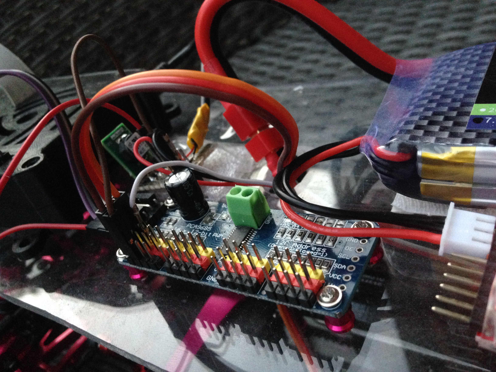

Due to how the servo is placed onto the car the steering response is not linear to the command. I had to calibrate the car to find its dead straight steering signal and then I divided the both sides, left and right, to have a linear response relative to their maximums.

Finally, thanks to a colleague who let me use the tools from Continental's car workshop, I cut the transparent plastic surface and placed the components on top. I screwed some and used some velcro for others (like the Raspberry Pi) so I could unmount them from the car when needed.

### Camera

The last component is the wide angle camera. It provides a wide 175° degrees field of view.

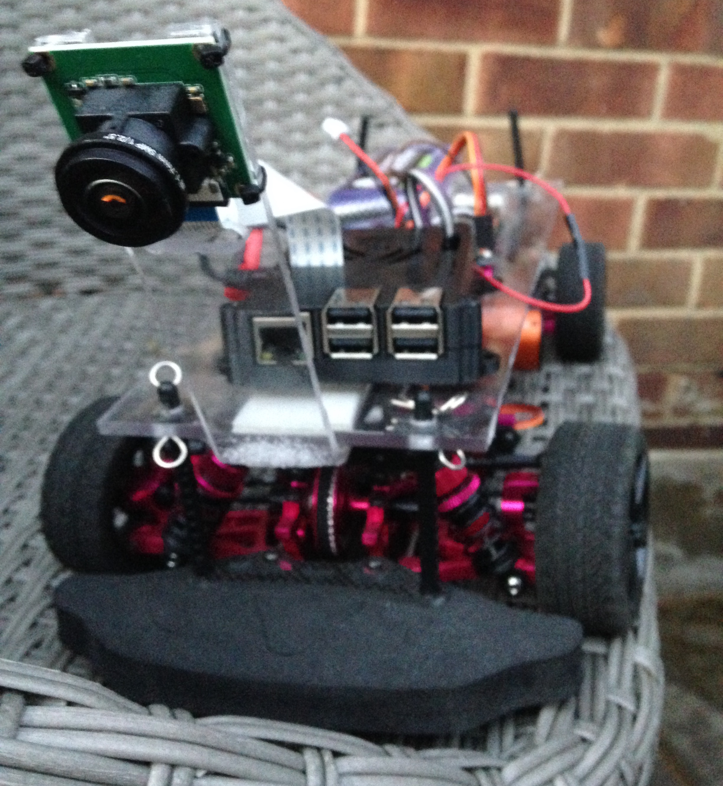

## Code

In terms of code I did not started from scratch. I forked the [donkey](https://github.com/wroscoe/donkey) repository which provided a lot of functionalities like interfacing with a PS3 controller, creating a webserver to control the car, saving the images with the normalised steering and throttle commands, and more. It took some time to adapt it to my needs.

### Neural Network Training

The idea behind this project is to teach the car how to drive. The first step is therefore for a human to drive the car around a track. The track can be made of anything, in any environment. The only thing you need to be consistent between the different tracks is some line on the side.
As the human driver steers the car around the track using a PS3 Sixasis controller, images from the camera are recorded and stored with the corresponding steering and throttle applied.

Example:

| Image        | Steering           | Throttle  |
| -------------|:------------------:| -----:|
| 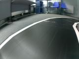     | 0.5051 | 0.02 |

Once enough data is recorded I went on the teach a neural network. It is also called _Behavior Cloning_.
Here is a detailed representation of each layers in the regression model I used:

```bash
__________________________________________________________________________________________________
Layer (type)                    Output Shape         Param #     Connected to
==================================================================================================
img_in (InputLayer)             (None, 120, 160, 3)  0
__________________________________________________________________________________________________
conv1 (Conv2D)                  (None, 58, 78, 24)   1824        img_in[0][0]
__________________________________________________________________________________________________
conv2 (Conv2D)                  (None, 27, 37, 32)   19232       conv1[0][0]
__________________________________________________________________________________________________
conv3 (Conv2D)                  (None, 12, 17, 64)   51264       conv2[0][0]
__________________________________________________________________________________________________
conv4 (Conv2D)                  (None, 5, 8, 64)     36928       conv3[0][0]
__________________________________________________________________________________________________
conv5 (Conv2D)                  (None, 3, 6, 64)     36928       conv4[0][0]
__________________________________________________________________________________________________
flattened (Flatten)             (None, 1152)         0           conv5[0][0]
__________________________________________________________________________________________________
dense_1 (Dense)                 (None, 100)          115300      flattened[0][0]
__________________________________________________________________________________________________
dropout_1 (Dropout)             (None, 100)          0           dense_1[0][0]
__________________________________________________________________________________________________
dense_2 (Dense)                 (None, 50)           5050        dropout_1[0][0]
__________________________________________________________________________________________________
dropout_2 (Dropout)             (None, 50)           0           dense_2[0][0]
__________________________________________________________________________________________________
angle_out (Dense)               (None, 1)            51          dropout_2[0][0]
__________________________________________________________________________________________________
throttle_out (Dense)            (None, 1)            51          dropout_2[0][0]
==================================================================================================
Total params: 266,628
Trainable params: 266,628
Non-trainable params: 0
__________________________________________________________________________________________________
```

The neural network is trained to output 2 values:
* `angle_out`: The steering angle to apply to the car.
* `throttle_out`: The throttle command.

#### Data Augmentation

If we take a closer look at the data, here is an example of the distribution in steering commands after some training circling around a track in only one direction. There is obviously a general bias towards the right (positive steering) and also vastly more `0` and `-1` commands issued. That is because with the PS3 controller, we often either don't touch it or press the joystick all way.

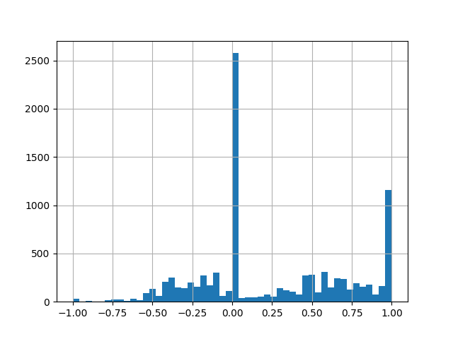

If we train the neural network with this data, the car will tend to always mostly straight and a little bit to the right. The network would have learned the prior knowledge that the response would most probably be straight of right.

The thing I did was to randomly flip the image horizontally and well as changing the sign the associated steering command with a probability `0.5`. The distribution become balanced between left and right.

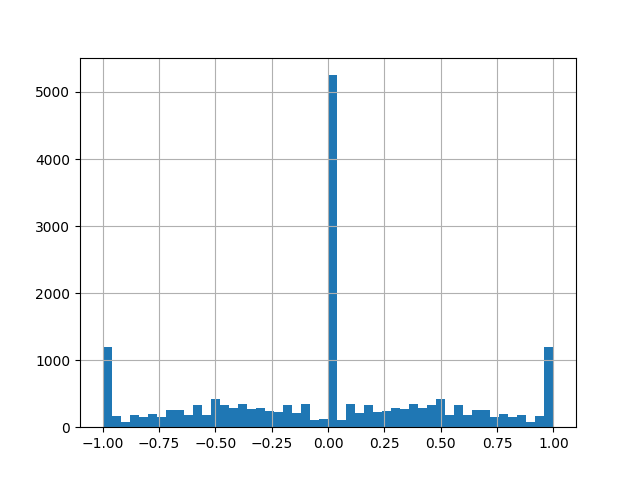

### Camera Calibration

I contributed back to project by providing a method for calibrating the camera people use on their car. It can be any kind on camera (wide angle or not). It uses opencv.

### Developments

In this [sakura donkey repository](https://github.com/Labonneguigue/SakuraDonkey) I have stored my personal developments.

## Results

Here is a video of the very first laps it did by itself.

<iframe width="560" height="315" src="https://www.youtube.com/embed/uuJ6OhvbwEc" frameborder="0" allow="autoplay; encrypted-media" allowfullscreen></iframe>

### Neural Network Visualisation

It seems like this neural network is little bit like black magic but it really isn't. What we can do is look at the internal activations at the same time as inference is happening to see what is causing the output.

By performing a deconvolution of the neural network after giving a sample image as input, the areas of activation can be stacked up into an image. It is also called the _saliency map_. Here is the resulting image with the saliency map merged in the input image.

<iframe width="560" height="315" src="https://www.youtube.com/embed/vgc8edacPLc" frameborder="0" allow="autoplay; encrypted-media" allowfullscreen></iframe>

## Conclusion

After finishing the Udacity Self-Driving Car Nanodegree program I was really eager to use what I learned and put it in practice. I glad the car goes around the track but that is not the end goal. I'll continue with calibration of the camera to enable more advanced computer vision algorithm to come to life on my raspberry pi.

---

