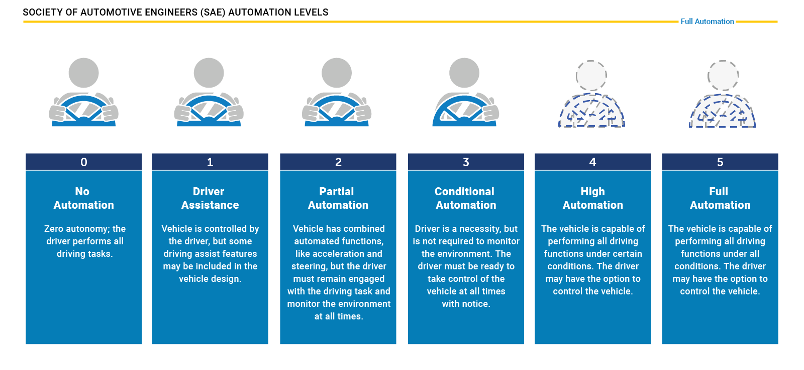
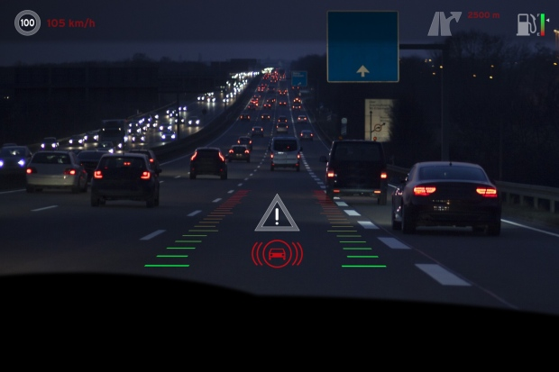
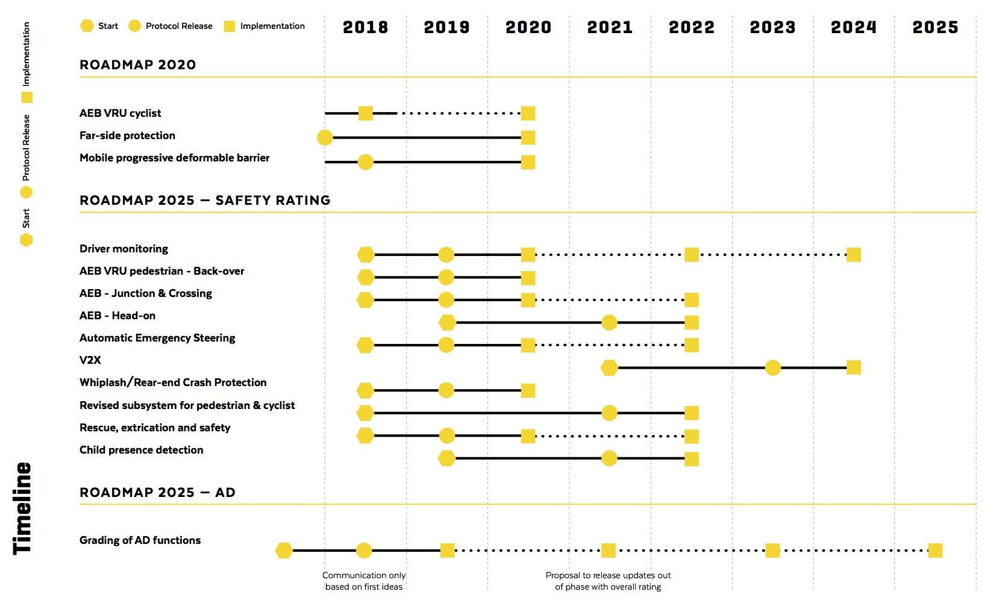

The vast majority of the automotive sector and its new comers have now taken part in the [_race to autonomy_](https://www.bloomberg.com/news/features/2018-05-07/who-s-winning-the-self-driving-car-race). Even tough I do not like the term, it is the reality. How it this race measured? Few can tell. One thing is known for sure, everybody ranks their systems using the **SAE Levels of Driving Automation**.

Let's recall what they are:

The SAE present them as such:

> SAE’s levels of driving automation are descriptive and informative, rather than normative.

Even though they are not normative, my impression is that is that ranking a new vehicle on this scale has pretty much become the norm. I do not think it is the only way up from where we stand today.

By assigning them a numerical order to them, it clearly defines a sequential process. You start with a car without any kind of automation (level 0) and you work your way up to the highest level (level 4). As a side note, I do not believe that level 5 will ever exist.

> Level 5: The sustained and __unconditional performance__ (i.e., not Operational Design Domain (ODD) specific) by an Automated Driving System of the entire Dynamic Driving Task (DDT) and DDT fallback __without any expectation that a user will respond to a request to intervene__.

Judge for yourself:

 

This implied progression form level 0 to level 4 is an incremental removal of the human driver. This type of automation is called **Series Automation** or _Chauffeur_ where the human control stops where the computer system takes over.

However us human are the best drivers we know so far. We are able to safely navigate immensely complex situations. Take the Place de l'Etoile in Paris or Hanoi, Vietnam:

<iframe width="560" height="315" src="https://www.youtube.com/embed/w0V4SK21UIE?start=150" frameborder="0" allow="autoplay; encrypted-media" allowfullscreen></iframe>

 

<iframe width="560" height="315" src="https://www.youtube.com/embed/Uz5uxAsrbwI?start=39" frameborder="0" allow="autoplay; encrypted-media" allowfullscreen></iframe>

 

And at the same time one of our biggest flaw is attention. Our attention can be diminished by a multitude of external factors like drowsiness, alcohol, typing a text, etc. See the [fight for safety]({{ site.baseurl }}). It causes the vast majority of fatalities on the road but they can be prevented through **Parallel Automation**.

The concept of parallel automation is to empower the human driver with a computer system monitoring the environment and intervening only if required in the intent to keep the passengers safe. The human driver has the full responsibility of performing the driving task however he is seconded by the car embedded "copilot" computer as a fallback.

I'll use the term Toyota is using to describe such a system: _Guardian_.

With a _Guardian_ system we can solve the safety problem of today's car sector while keeping the humans at the wheel and the thrill of driving.
Imagine how much fun it would be to go through scenic routes in the mountains with your BMW M3 experiencing exhilarating acceleration and knowing that if by accident you would want to go around a curve too fast the car would slow you down just the right amount because it knew the curve was too tight and you would have lost grip.

With a _Guardian_ system, the drowsy driver could be kept in the lane as he was falling asleep.
With a _Guardian_ system, the car would become uncrashable thanks to the safety envelop provided by the system.

<iframe width="560" height="315" src="https://www.youtube.com/embed/i0tEg7l-MNw" frameborder="0" allow="autoplay; encrypted-media" allowfullscreen></iframe>

 

The idea is to augment the capabilities of the driver. This could be achieved by displaying all kinds of information on a Head-Up Display (HUD) that the advanced sensors (LIDAR, RADAR, Infrared cameras) perceive.

[EuroNCAP](https://www.euroncap.com/en) rates the safety of each vehicle sold in the European Union based on their behavior in a crash and also based on the presence and efficiency of its safety systems. [Here is an example](https://www.euroncap.com/en/results/audi/a6/33445). I personally think that there should be even more emphasis on the work EuroNCAP is doing to raise consumer awareness.

Here is their 2025 roadmap:

On the contrary, who enjoys driving to work. Being in traffic, constantly vigilant. It is stressful. That is where L4-capable vehicles are the real solution.

I strongly believe that there is a case to make for the usefulness of both systems. Campuses, airports and dense urban would benefit greatly of having autonomous shuttles. In the mean time the safety of our human driven cars would be significantly increased if we apply some _Guardian_ type technology to enhance the skills of the human driver instead of treating them like a disease.

I am truly in favor of autonomous vehicles. I think they will be revolutionary on many levels and that they will disrupt almost all sectors of our economy for the better. I also think they will create more jobs than they will replace.

I would like to see companies move away from the dogma that are the SAE levels of automation as a sequential framework where each level leads to the next and where no other path is possible.
It is established (at least for me and [Alex Roy](http://www.thedrive.com/opinion/22332/uberpocalyft-now) and the [Human Driving Association](http://humandriving.org/)) that human driving is here to stay. We should also focus a great deal on making every human driven vehicle safer.

Ultimately the best car would have both system. The _Guardian_ system would protect me when I decide to drive and when I'm not in the mood or I want to do something else I would enable the _Chauffeur_ mode and the car would be totally in charge of the driving task.

[//]: # "Tech Crunch https://techcrunch.com/2017/09/27/toyota-research-institute-self-driving-2-1/"

[//]: # "https://www.telegraph.co.uk/travel/lists/the-worlds-best-drives/"
